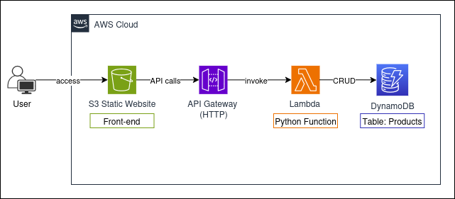
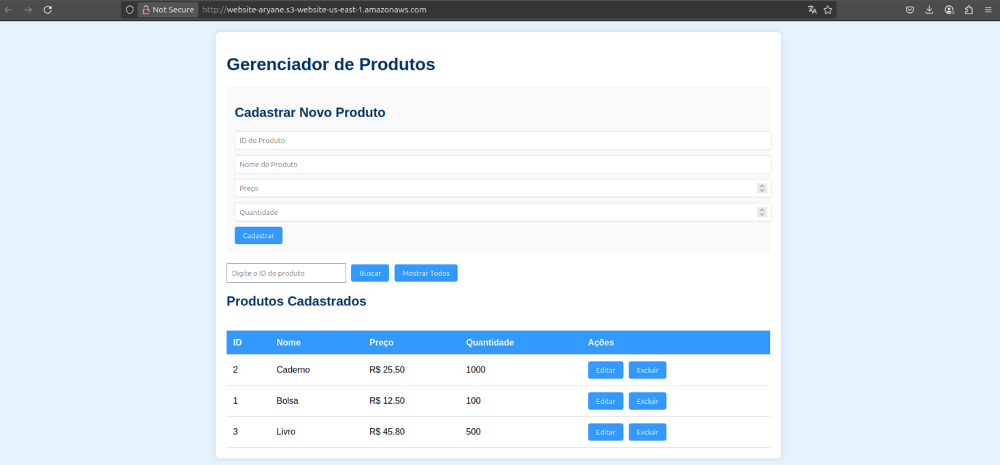
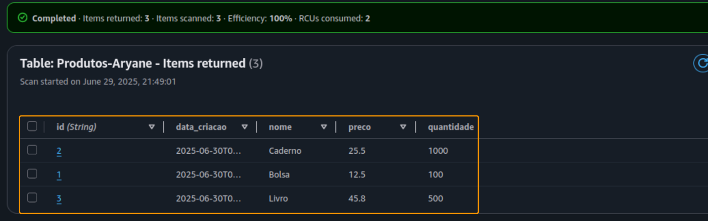
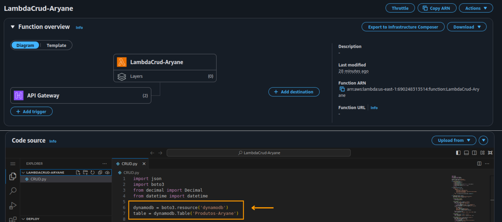
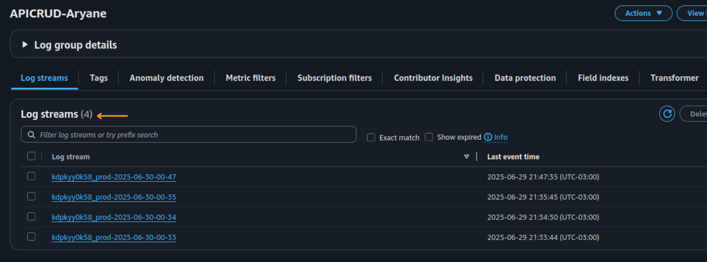

# 🧪 Laboratório - Aplicação Serverless com DynamoDB, Lambda e API Gateway

Este projeto foi desenvolvido como parte das atividades práticas da **Escola da Nuvem** e demonstra a construção de uma aplicação web serverless com backend em **AWS Lambda (Python)** e banco de dados **Amazon DynamoDB**, integrados por meio do **API Gateway**. A interface web é hospedada em um **bucket S3**, e o monitoramento é realizado com **Amazon CloudWatch**.

---

## 🧱 Arquitetura da Solução

---

## 🚀 Tecnologias Utilizadas

- **Amazon DynamoDB** – Banco NoSQL com alta performance
- **AWS Lambda (Python)** – Função para operações CRUD
- **API Gateway** – Integração HTTP com a função Lambda
- **Amazon S3** – Hospedagem estática da interface web
- **Amazon CloudWatch** – Monitoramento e logs
- **IAM** – Permissões para execução dos serviços

---

## 📌 Objetivos do Projeto

- Criar uma aplicação web CRUD de produtos utilizando arquitetura serverless.
- Operar com segurança e governança em nuvem.
- Monitorar e validar o funcionamento completo da solução.

---

## ⚙️ Funcionalidades

- Criação de tabela no DynamoDB com chave `id`
- Função Lambda com CRUD completo (Create, Read, Update, Delete)
- Integração da API via API Gateway com rotas HTTP
- Interface web simples, responsiva e hospedada no S3
- Configuração de CORS e monitoramento via CloudWatch Logs

---

## 🖼️ Capturas de Tela

### Aplicação Web Operacional no Amazon S3 com Produtos Cadastrados
  

### Visualização dos Registros Persistidos no DynamoDB
  

### Implementação da Função Lambda Integrada ao DynamoDB  
  

### Log de execução no Amazon CloudWatch  
  

---

## ✅ Resultado Final

- Aplicação CRUD funcional na nuvem
- Site acessível via URL pública do S3
- Requisições roteadas via API Gateway
- Logs completos de execução no CloudWatch

---
